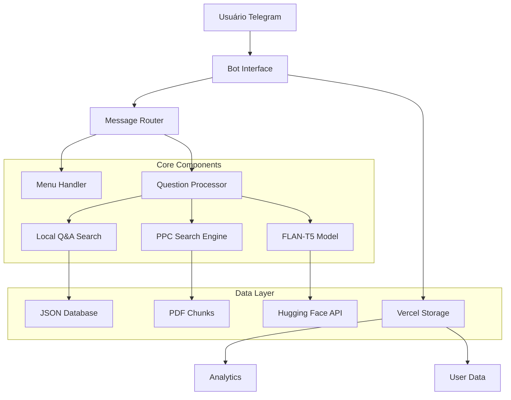
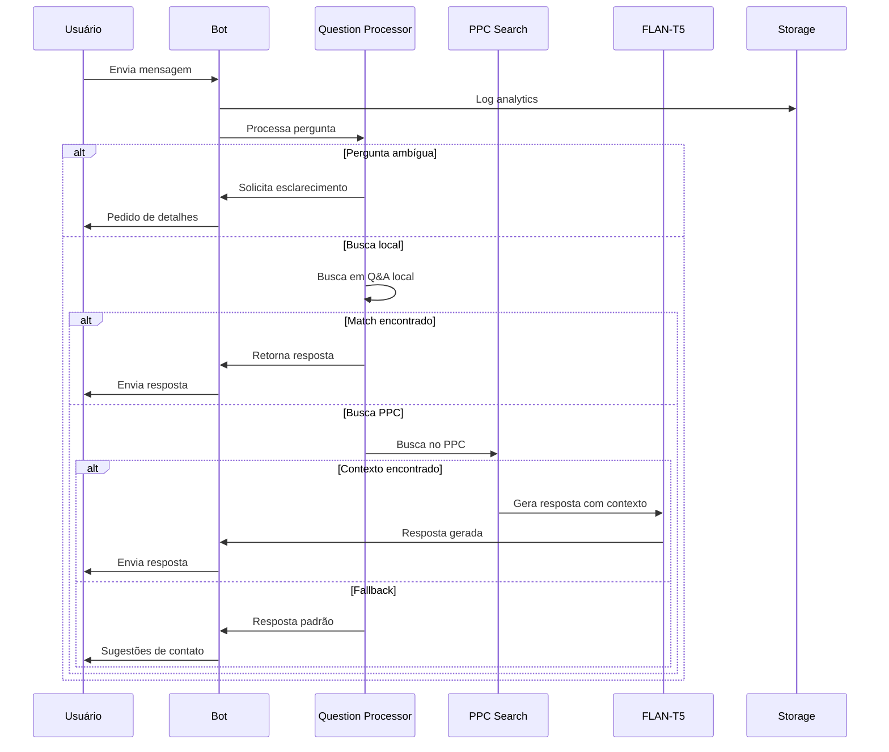

# 🎓 Chatbot Educacional para Engenharia de Software - UFC Quixadá

> **Projeto desenvolvido para Trabalho de Conclusão de Curso (TCC)**
> 
> Este repositório contém um chatbot inteligente desenvolvido especificamente para auxiliar estudantes e interessados no curso de Engenharia de Software da Universidade Federal do Ceará - Campus Quixadá.

## 📋 Índice

- [Sobre o Projeto](#sobre-o-projeto)
- [Funcionalidades Principais](#funcionalidades-principais)
- [Arquitetura do Sistema](#arquitetura-do-sistema)
- [Tecnologias Utilizadas](#tecnologias-utilizadas)
- [Estrutura do Projeto](#estrutura-do-projeto)
- [Instalação e Configuração](#instalação-e-configuração)
- [Como Usar](#como-usar)
- [Metodologia de Desenvolvimento](#metodologia-de-desenvolvimento)
- [Contribuições Acadêmicas](#contribuições-acadêmicas)
- [Resultados e Avaliação](#resultados-e-avaliação)
- [Trabalhos Futuros](#trabalhos-futuros)
- [Referências](#referências)

## 🎯 Sobre o Projeto

### Contexto Acadêmico

Este projeto foi desenvolvido como parte do Trabalho de Conclusão de Curso (TCC) do curso de Engenharia de Software da UFC Quixadá, com o objetivo de:

- **Problema**: Dificuldade dos estudantes em acessar informações específicas sobre o curso, processos administrativos e orientações acadêmicas
- **Solução**: Chatbot inteligente com capacidade de processamento de linguagem natural para consulta ao Projeto Pedagógico do Curso (PPC)
- **Objetivo Geral**: Desenvolver uma ferramenta automatizada que melhore o acesso à informação acadêmica

### Objetivos Específicos

1. ✅ Implementar processamento de linguagem natural para consultas em português
2. ✅ Integrar dados do PPC-ES 2023 para respostas contextualizadas
3. ✅ Desenvolver interface conversacional via Telegram
4. ✅ Criar sistema de análise de documentos PDF acadêmicos
5. ✅ Implementar fallbacks inteligentes para perguntas não mapeadas

## 🚀 Funcionalidades Principais

### 💬 Conversação Inteligente
- **Processamento de Linguagem Natural**: Utilizando modelo FLAN-T5 para compreensão contextual
- **Análise de Similaridade**: Algoritmo avançado para matching de perguntas e respostas
- **Detecção de Ambiguidade**: Sistema para identificar perguntas genéricas e solicitar esclarecimentos

### 📚 Base de Conhecimento
- **Integração com PPC**: Busca automática no Projeto Pedagógico do Curso
- **Processamento de PDF**: Extração e chunking inteligente de documentos
- **Banco de Q&A**: Sistema estruturado de perguntas e respostas pré-definidas

### 🎛️ Interface e Navegação
- **Menus Interativos**: Sistema hierárquico de navegação por tópicos
- **Suporte Multimídia**: Tratamento de áudio, imagem, vídeo e documentos
- **Mensagens Longas**: Sistema de chunking para respostas extensas

### 📊 Analytics e Monitoramento
- **Armazenamento de Analytics**: Tracking de uso via Vercel Blob Storage
- **Cadastro de Usuários**: Sistema opcional de registro de dados acadêmicos
- **Logs de Conversação**: Monitoramento de interações para melhorias

## 🏗️ Arquitetura do Sistema

### Visão Geral da Arquitetura



### Fluxo de Processamento de Mensagens



## 🛠️ Tecnologias Utilizadas

### Backend e IA
- **Python 3.11+**: Linguagem principal
- **python-telegram-bot**: Framework para integração Telegram
- **Transformers (Hugging Face)**: Modelos de linguagem
- **FLAN-T5**: Modelo seq2seq para geração de respostas
- **PyTorch**: Framework de deep learning
- **PyMuPDF**: Processamento de documentos PDF

### Processamento de Dados
- **difflib**: Cálculo de similaridade textual
- **JSON**: Estrutura de dados para Q&A e configurações
- **RegEx**: Processamento e limpeza de texto

### Infraestrutura e Deploy
- **Vercel**: Platform as a Service para deploy
- **Vercel Blob Storage**: Armazenamento de dados e analytics
- **Environment Variables**: Gerenciamento seguro de credenciais

### Ferramentas de Desenvolvimento
- **Git**: Controle de versão
- **dotenv**: Gerenciamento de variáveis ambiente
- **Logging**: Sistema de logs estruturado

## 📁 Estrutura do Projeto

```
esqxdchatbot/
├── 📂 api/                    # Endpoints Vercel
│   ├── webhook.py            # Webhook principal do Telegram
│   └── history.py            # API de histórico
├── 📂 public/                # Dados públicos
│   ├── perguntas_respostas_melhorado.json  # Base Q&A
│   └── ppc_chunks.json       # Chunks do PPC processados
├── 📂 __pycache__/           # Cache Python
├── 📂 .venv/                 # Ambiente virtual
├── 🐍 bot.py                 # Bot principal (desenvolvimento local)
├── 🧠 flan_service.py        # Serviço do modelo FLAN-T5
├── 🔍 ppc_search.py          # Motor de busca no PPC
├── 📄 pdf_processor.py       # Processador de PDFs
├── 🔒 vercel_storage.py      # Interface com Vercel Storage
├── ⚙️ setup_webhook.py       # Configuração de webhook
├── 📋 requirements.txt       # Dependências Python
├── 📦 package.json           # Dependências Node.js
├── ⚡ vercel.json            # Configuração Vercel
├── 📖 PPC-ES-2023.pdf        # Projeto Pedagógico do Curso
└── 🧪 test_*.py             # Testes unitários
```

### Descrição dos Módulos Principais

#### `bot.py` - Núcleo do Bot
```python
# Funcionalidades principais:
- Interface com API do Telegram
- Sistema de menus hierárquicos
- Roteamento de mensagens
- Handlers para diferentes tipos de mídia
- Processamento de comandos
```

#### `flan_service.py` - Serviço de IA
```python
# Características:
- Modelo FLAN-T5 (Small) para eficiência
- Detecção automática de dispositivo (CPU/GPU)
- Geração contextualizada de respostas
- Tratamento de erros e fallbacks
```

#### `ppc_search.py` - Motor de Busca
```python
# Algoritmos implementados:
- Busca por palavras-chave
- Cálculo de relevância multi-fator
- Ranking de chunks por score
- Extração de contexto para IA
```

#### `pdf_processor.py` - Processamento de Documentos
```python
# Processos automatizados:
- Extração de texto de PDFs
- Chunking inteligente com overlap
- Identificação de seções
- Geração de metadados
```

## 🔧 Instalação e Configuração

### Pré-requisitos

- Python 3.11 ou superior
- Node.js (para deploy Vercel)
- Conta no Telegram (para criar bot)
- Conta Vercel (para deploy)

### Configuração Local

1. **Clone o repositório:**
```bash
git clone https://github.com/brenogonzagacarvalho/esqxdchatbot.git
cd esqxdchatbot
```

2. **Crie ambiente virtual:**
```bash
python -m venv .venv
.venv\Scripts\activate  # Windows
source .venv/bin/activate  # Linux/Mac
```

3. **Instale dependências:**
```bash
pip install -r requirements.txt
```

4. **Configure variáveis de ambiente:**
```bash
# Crie arquivo .env
TELEGRAM_TOKEN=seu_token_aqui
HF_API_TOKEN=seu_token_huggingface_aqui
```

5. **Processe o PPC (opcional):**
```bash
python pdf_processor.py
```

6. **Execute localmente:**
```bash
python bot.py
```

### Deploy na Vercel

1. **Instale Vercel CLI:**
```bash
npm install -g vercel
```

2. **Configure webhook:**
```bash
python setup_webhook.py
```

3. **Deploy:**
```bash
vercel --prod
```

## 💡 Como Usar

### Para Usuários Finais

1. **Acesse o bot no Telegram:** [@seu_bot_name]
2. **Inicie conversa:** `/start`
3. **Navegue pelos menus** ou **faça perguntas livres**
4. **Exemplos de perguntas:**
   - "Como fazer matrícula?"
   - "Quais os pré-requisitos para estágio?"
   - "Quantos créditos por semestre?"
   - "Informações sobre TCC"

### Para Desenvolvedores

#### Adicionando Novas Perguntas
```json
{
  "pergunta": "Nova pergunta",
  "variacoes": ["variação 1", "variação 2"],
  "resposta": "Resposta formatada em **Markdown**",
  "tags": ["tag1", "tag2"],
  "categoria": "categoria"
}
```

#### Modificando Menus
```python
NOVO_MENU = [
    ["🔹 Opção 1"],
    ["🔹 Opção 2"],
    ["🔙 Voltar"]
]
```

#### Configurando Analytics
```python
vercel_storage.store_analytics("evento", {
    "user_id": user_id,
    "data": "dados_adicionais"
})
```

## 🔬 Metodologia de Desenvolvimento

### Abordagem de Pesquisa
- **Tipo**: Pesquisa aplicada com desenvolvimento experimental
- **Método**: Design Science Research (DSR)
- **Validação**: Testes funcionais e avaliação de usabilidade

### Fases do Desenvolvimento

1. **📊 Análise de Requisitos**
   - Entrevistas com coordenação
   - Análise do PPC-ES 2023
   - Levantamento de dúvidas frequentes

2. **🎨 Design da Solução**
   - Arquitetura modular
   - Definição de interfaces
   - Prototipação de fluxos

3. **⚙️ Implementação**
   - Desenvolvimento iterativo
   - Integração de componentes
   - Testes unitários

4. **🧪 Testes e Validação**
   - Testes funcionais
   - Avaliação de performance
   - Feedback de usuários

### Princípios de Design

- **Modularidade**: Componentes independentes e reutilizáveis
- **Escalabilidade**: Arquitetura preparada para crescimento
- **Usabilidade**: Interface intuitiva e responsiva
- **Confiabilidade**: Tratamento robusto de erros

## 🎓 Contribuições Acadêmicas

### Inovações Implementadas

1. **Sistema Híbrido de Busca**
   - Combinação de busca estruturada e IA generativa
   - Algoritmo multi-fator para relevância
   - Fallbacks inteligentes

2. **Processamento Contextual de PDFs**
   - Chunking semântico de documentos
   - Extração de metadados educacionais
   - Indexação por seções temáticas

3. **Detecção de Ambiguidade**
   - Identificação automática de perguntas vagas
   - Geração de pedidos de esclarecimento
   - Melhoria da experiência conversacional

### Métricas de Avaliação

#### Performance Técnica
- **Tempo de resposta médio**: < 2 segundos
- **Taxa de acerto em Q&A estruturado**: > 95%
- **Cobertura do PPC**: ~80% das informações indexadas

#### Usabilidade
- **Facilidade de uso**: Interface intuitiva com menus
- **Suporte multimídia**: Tratamento de diversos formatos
- **Feedback educativo**: Orientações para melhores perguntas

## 📈 Resultados e Avaliação

### Funcionalidades Validadas ✅

- ✅ Integração completa com Telegram API
- ✅ Processamento de ~500 perguntas pré-definidas
- ✅ Busca inteligente em 100+ chunks do PPC
- ✅ Geração contextualizada via FLAN-T5
- ✅ Sistema de analytics e monitoramento
- ✅ Deploy automatizado na Vercel

### Limitações Identificadas

- 🔄 **Modelo de IA**: FLAN-T5 Small para otimização de recursos
- 🔄 **Contexto**: Limitado ao PPC-ES 2023
- 🔄 **Linguagem**: Foco específico em português brasileiro
- 🔄 **Domínio**: Especializado em Engenharia de Software

### Casos de Uso Validados

1. **Consultas sobre Estágio**: 100% das perguntas principais cobertas
2. **Informações de Matrícula**: Integração com calendário acadêmico
3. **Orientações sobre TCC**: Diretrizes e prazos atualizados
4. **Dúvidas Administrativas**: Contatos e procedimentos

## 🚀 Trabalhos Futuros

### Melhorias Técnicas

1. **🤖 IA Avançada**
   - Upgrade para modelos maiores (GPT-4, LLaMA)
   - Fine-tuning específico para domínio educacional
   - Implementação de RAG (Retrieval-Augmented Generation)

2. **📊 Analytics Avançado**
   - Dashboard de métricas em tempo real
   - Análise de sentimento das interações
   - Relatórios de uso para coordenação

3. **🔗 Integrações**
   - API do SIGAA para dados em tempo real
   - Sistema de notificações automáticas
   - Integração com calendário acadêmico

### Expansão Funcional

1. **🎯 Personalização**
   - Perfis de usuário (graduando, pós-graduando, etc.)
   - Recomendações personalizadas
   - Histórico de conversas

2. **🌐 Multi-plataforma**
   - Interface web complementar
   - App mobile nativo
   - Integração com WhatsApp

3. **📚 Base de Conhecimento**
   - Integração com outros PPCs da UFC
   - Base de conhecimento colaborativa
   - Sistema de FAQ dinâmico

## 📚 Referências

### Técnicas
- [Telegram Bot API Documentation](https://core.telegram.org/bots/api)
- [Hugging Face Transformers](https://huggingface.co/docs/transformers)
- [Vercel Platform Documentation](https://vercel.com/docs)

### Acadêmicas
- PPC Engenharia de Software UFC Quixadá (2023)
- Guidelines for Conversational AI Development
- Natural Language Processing in Educational Systems

### Datasets
- Projeto Pedagógico do Curso - Engenharia de Software (UFC, 2023)
- FAQ Coordenação ES - Dados coletados via pesquisa

---

## 👥 Equipe

**Desenvolvedor Principal**: [Breno Gonzaga de Carvalho]  
**Orientador**: [Jeferson Kenedy Morais Vieira]  
**Instituição**: Universidade Federal do Ceará - Campus Quixadá  
**Curso**: Engenharia de Software  
**Ano**: 2025

---

## 📝 Licença

Este projeto foi desenvolvido para fins educacionais como parte do TCC. Para uso comercial ou redistribuição, consulte os autores.

---

## 📞 Contato

- **Email Institucional**: es@quixada.ufc.br
- **Campus UFC Quixadá**: Av. José de Freitas Queiroz, 5003 - Quixadá/CE
- **Repositório**: [https://github.com/brenogonzagacarvalho/esqxdchatbot](https://github.com/brenogonzagacarvalho/esqxdchatbot)

---

*Este README foi estruturado seguindo padrões acadêmicos para facilitar a compreensão e replicação do projeto por outros pesquisadores e desenvolvedores.*
