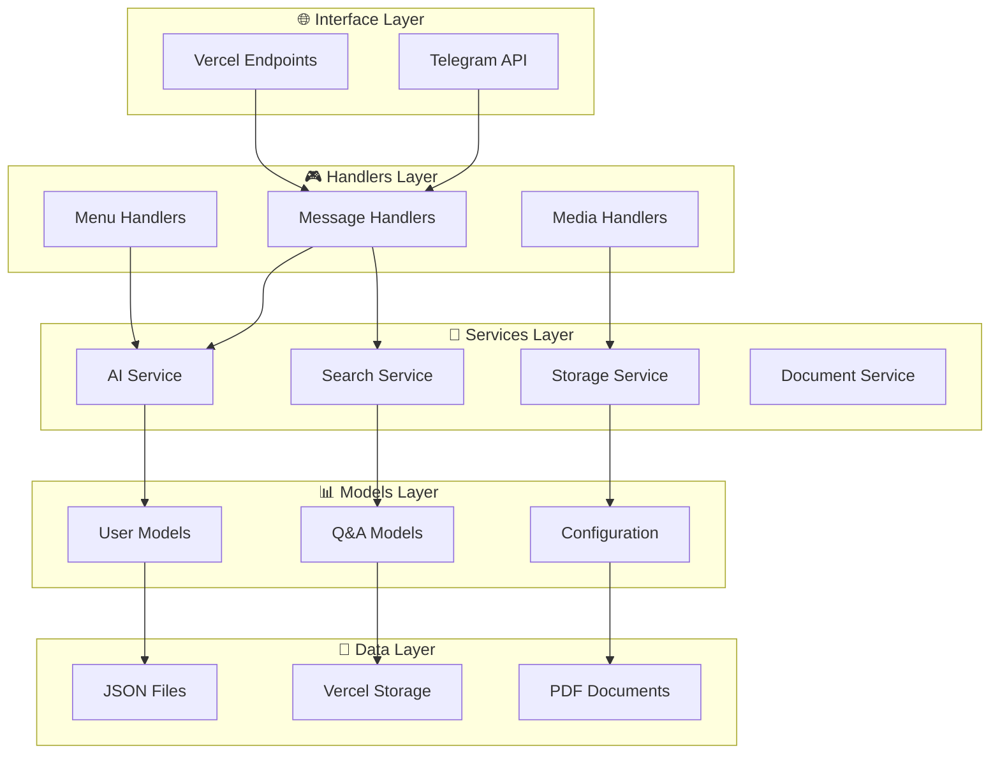
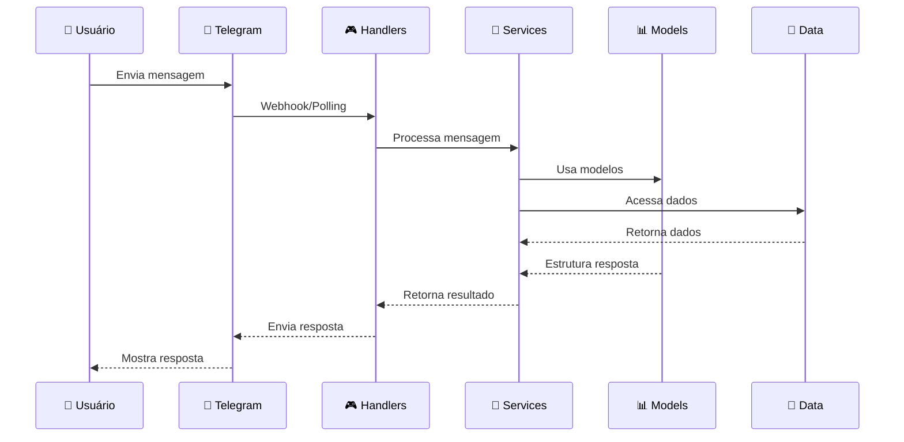
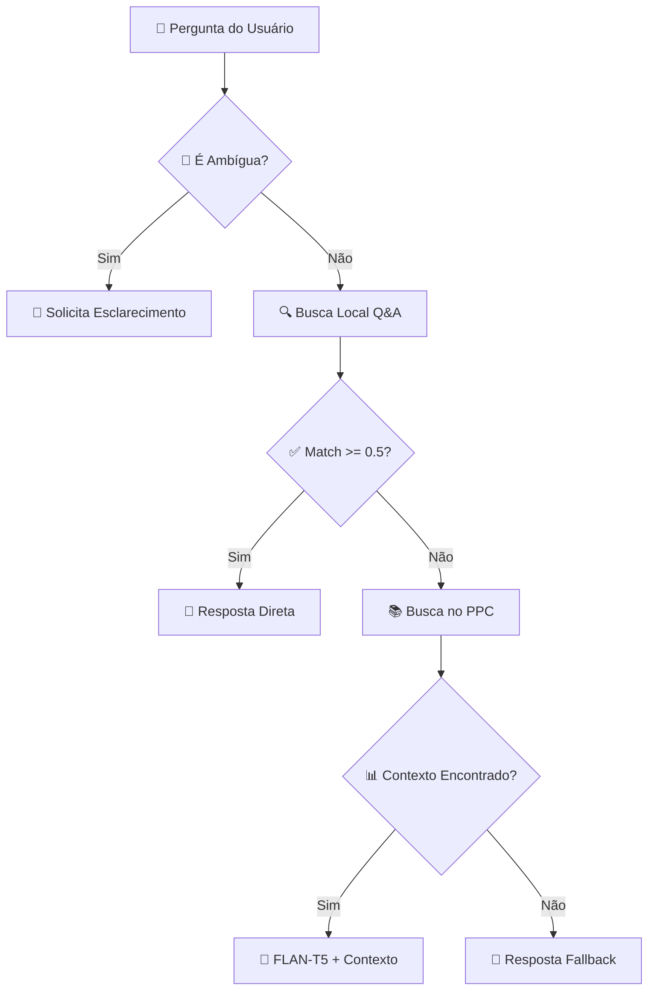

# 🏗️ Arquitetura do Sistema - Chatbot Educacional

> **Documentação técnica da arquitetura seguindo padrões de Clean Architecture e DDD**

## 📋 Índice

- [Visão Geral](#visão-geral)
- [Estrutura de Diretórios](#estrutura-de-diretórios)
- [Camadas da Aplicação](#camadas-da-aplicação)
- [Fluxo de Dados](#fluxo-de-dados)
- [Padrões Utilizados](#padrões-utilizados)
- [Princípios Arquiteturais](#princípios-arquiteturais)

## 🎯 Visão Geral

O sistema foi reestruturado seguindo princípios de **Clean Architecture** e **Domain-Driven Design (DDD)** para garantir:

- **Separação de responsabilidades**
- **Facilidade de manutenção**
- **Testabilidade**
- **Extensibilidade**
- **Organização acadêmica adequada**

### Arquitetura por Camadas



## 📁 Estrutura de Diretórios

```
esqxdchatbot/
├── 🏠 main.py                     # Ponto de entrada principal
├── ⚙️ config/                     # Configurações centralizadas
│   ├── __init__.py
│   ├── settings.py               # Configurações da aplicação
│   └── logging_config.py         # Configuração de logs
├── 🧠 src/                        # Código fonte principal
│   ├── __init__.py
│   ├── 🎯 core/                   # Núcleo da aplicação
│   │   ├── __init__.py
│   │   └── bot.py                # Bot principal
│   ├── 🔧 services/               # Camada de serviços
│   │   ├── __init__.py
│   │   ├── 🤖 ai/                 # Serviços de IA
│   │   │   ├── __init__.py
│   │   │   └── flan_service.py
│   │   ├── 🔍 search/             # Serviços de busca
│   │   │   ├── __init__.py
│   │   │   └── ppc_search.py
│   │   ├── 💾 storage/            # Serviços de armazenamento
│   │   │   ├── __init__.py
│   │   │   └── vercel_storage.py
│   │   └── 📄 document/           # Processamento de documentos
│   │       ├── __init__.py
│   │       └── pdf_processor.py
│   ├── 🎮 handlers/               # Manipuladores de eventos
│   │   ├── __init__.py
│   │   ├── telegram/             # Handlers específicos do Telegram
│   │   ├── menu/                 # Handlers de menu
│   │   └── media/                # Handlers de mídia
│   ├── 📊 models/                 # Modelos de dados
│   │   ├── __init__.py
│   │   ├── user.py               # Modelos de usuário
│   │   └── qa.py                 # Modelos de Q&A
│   ├── 🛠️ utils/                  # Utilitários
│   │   └── __init__.py
│   └── 🔀 middleware/             # Middleware
│       └── __init__.py
├── 📊 data/                       # Dados da aplicação
│   ├── 📝 qa/                     # Dados de Q&A
│   │   ├── perguntas_respostas_melhorado.json
│   │   └── ppc_chunks.json
│   ├── 📁 raw/                    # Dados brutos
│   │   └── PPC-ES-2023.pdf
│   └── ⚙️ processed/              # Dados processados
├── 🧪 tests/                      # Testes
│   ├── __init__.py
│   ├── conftest.py               # Configuração de testes
│   ├── 🔬 unit/                   # Testes unitários
│   │   ├── test_bot.py
│   │   └── test_filters.py
│   ├── 🔗 integration/            # Testes de integração
│   └── 📋 fixtures/               # Dados de teste
├── 📚 docs/                       # Documentação
│   ├── examples/                 # Exemplos de uso
│   └── ARQUITETURA.md           # Este arquivo
├── 🔧 scripts/                    # Scripts utilitários
│   └── setup_webhook.py
└── 🌐 api/                        # Endpoints da API
    ├── webhook.py
    └── history.py
```

## 🎯 Camadas da Aplicação

### 1. 🏠 **Main Layer** (Entrada)
- **main.py**: Ponto de entrada único da aplicação
- **Responsabilidades**: Inicialização, configuração, orquestração

### 2. ⚙️ **Configuration Layer**
- **settings.py**: Configurações centralizadas
- **logging_config.py**: Configuração de logs
- **Responsabilidades**: Gestão de configurações e ambiente

### 3. 🎯 **Core Layer** (Núcleo)
- **bot.py**: Lógica principal do bot
- **Responsabilidades**: Orquestração de handlers e serviços

### 4. 🎮 **Handlers Layer** (Manipuladores)
- **telegram/**: Handlers específicos do Telegram
- **menu/**: Lógica de navegação por menus
- **media/**: Processamento de diferentes mídias
- **Responsabilidades**: Processamento de entrada do usuário

### 5. 🔧 **Services Layer** (Serviços)
- **ai/**: Serviços de inteligência artificial
- **search/**: Serviços de busca e recuperação
- **storage/**: Serviços de armazenamento
- **document/**: Processamento de documentos
- **Responsabilidades**: Lógica de negócio especializada

### 6. 📊 **Models Layer** (Modelos)
- **user.py**: Modelos relacionados a usuários
- **qa.py**: Modelos de perguntas e respostas
- **Responsabilidades**: Estruturas de dados e entidades

### 7. 💾 **Data Layer** (Dados)
- **qa/**: Dados de perguntas e respostas
- **raw/**: Dados brutos (PDFs, etc.)
- **processed/**: Dados processados
- **Responsabilidades**: Persistência e armazenamento

## 🔄 Fluxo de Dados

### Fluxo Principal de Processamento



### Fluxo de Busca Inteligente



## 🛠️ Padrões Utilizados

### 1. **Clean Architecture**
- **Separação por camadas** com dependências direcionadas para dentro
- **Inversão de dependência** através de interfaces
- **Independência de frameworks** externos

### 2. **Domain-Driven Design (DDD)**
- **Organização por domínios** (AI, Search, Storage)
- **Modelos ricos** com lógica de negócio
- **Linguagem ubíqua** do domínio educacional

### 3. **Repository Pattern**
- **Abstração do acesso a dados** através de interfaces
- **Flexibilidade** para trocar implementações
- **Facilita testes** com mocks

### 4. **Service Layer Pattern**
- **Encapsulamento da lógica de negócio** em serviços
- **Reutilização** de funcionalidades
- **Separação de responsabilidades**

### 5. **Factory Pattern**
- **Criação centralizada** de objetos complexos
- **Configuração** baseada em ambiente
- **Flexibilidade** na instanciação

## 🎯 Princípios Arquiteturais

### 1. **Single Responsibility Principle (SRP)**
- Cada classe/módulo tem **uma única responsabilidade**
- **Coesão alta**, **acoplamento baixo**

### 2. **Open/Closed Principle (OCP)**
- **Aberto para extensão**, **fechado para modificação**
- Novos serviços podem ser adicionados sem modificar existentes

### 3. **Liskov Substitution Principle (LSP)**
- **Interfaces bem definidas** que podem ser substituídas
- **Polimorfismo** nos serviços

### 4. **Interface Segregation Principle (ISP)**
- **Interfaces específicas** para cada necessidade
- Evita dependências desnecessárias

### 5. **Dependency Inversion Principle (DIP)**
- **Dependência de abstrações**, não de implementações
- **Inversão de controle** através de injeção de dependência

## 📈 Benefícios da Nova Arquitetura

### Para Desenvolvimento
- ✅ **Código mais organizado** e fácil de navegar
- ✅ **Testes mais simples** e isolados
- ✅ **Manutenção facilitada** com responsabilidades claras
- ✅ **Extensibilidade** para novas funcionalidades

### Para Acadêmicos
- ✅ **Estrutura profissional** adequada para TCC
- ✅ **Padrões de mercado** aplicados
- ✅ **Documentação clara** da arquitetura
- ✅ **Facilita estudos** de engenharia de software

### Para Evolução
- ✅ **Preparado para crescimento** do projeto
- ✅ **Integração facilitada** com novos serviços
- ✅ **Deploy flexível** em diferentes ambientes
- ✅ **Monitoramento granular** por camada

---

*Esta arquitetura foi projetada para demonstrar aplicação prática de conceitos avançados de engenharia de software em um projeto acadêmico real.*
