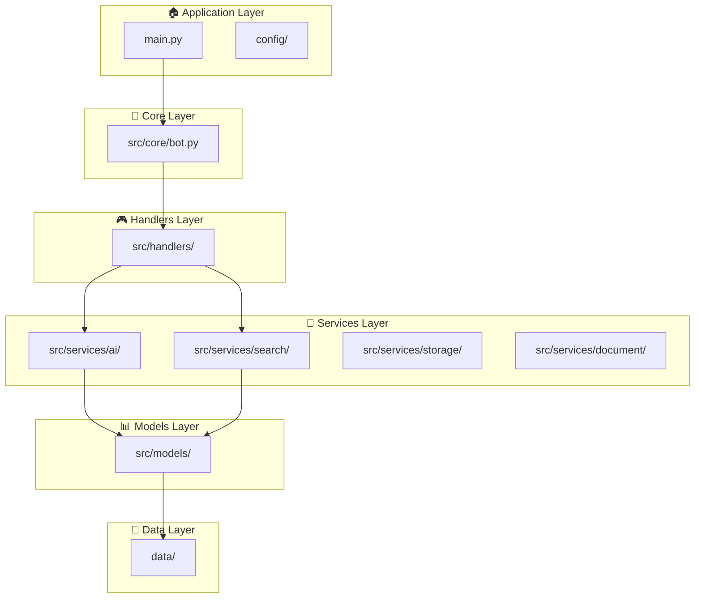

# 🔄 Guia de Migração - Nova Estrutura Arquitetural

> **Documentação da migração para Clean Architecture + DDD**

## 📋 Índice

- [Motivação](#motivação)
- [Mudanças Principais](#mudanças-principais)
- [Mapeamento de Arquivos](#mapeamento-de-arquivos)
- [Como Atualizar](#como-atualizar)
- [Vantagens da Nova Estrutura](#vantagens-da-nova-estrutura)
- [Troubleshooting](#troubleshooting)

## 🎯 Motivação

A reestruturação foi implementada para:

### 📚 **Fins Acadêmicos**
- Demonstrar aplicação de **Clean Architecture**
- Seguir princípios de **Domain-Driven Design (DDD)**
- Mostrar **boas práticas** de engenharia de software
- Facilitar **manutenção e extensão** do projeto

### 🏢 **Padrões Profissionais**
- Estrutura **escalável** e **organizativa**
- **Separação clara** de responsabilidades
- **Facilita testes** unitários e de integração
- **Preparado para crescimento** do projeto

## 🔄 Mudanças Principais

### Estrutura Anterior vs Nova

| **Aspecto** | **Anterior** | **Nova** |
|-------------|--------------|----------|
| **Organização** | Arquivos na raiz | Estrutura por camadas |
| **Ponto de entrada** | `bot.py` | `main.py` |
| **Configuração** | Variáveis espalhadas | `config/` centralizado |
| **Serviços** | Arquivos soltos | `src/services/` |
| **Dados** | `public/` | `data/` com subdiretórios |
| **Testes** | Arquivos na raiz | `tests/` organizados |
| **Docs** | `examples/` | `docs/` estruturados |

### Arquitetura por Camadas



## 📁 Mapeamento de Arquivos

### Arquivos Movidos

| **Arquivo Anterior** | **Nova Localização** | **Motivo** |
|---------------------|----------------------|------------|
| `bot.py` | `src/core/bot.py` | Núcleo da aplicação |
| `flan_service.py` | `src/services/ai/flan_service.py` | Serviço de IA |
| `ppc_search.py` | `src/services/search/ppc_search.py` | Serviço de busca |
| `pdf_processor.py` | `src/services/document/pdf_processor.py` | Serviço de documentos |
| `vercel_storage.py` | `src/services/storage/vercel_storage.py` | Serviço de storage |
| `public/` | `data/qa/` | Organização de dados |
| `PPC-ES-2023.pdf` | `data/raw/PPC-ES-2023.pdf` | Dados brutos |
| `test_*.py` | `tests/unit/` | Testes organizados |
| `setup_webhook.py` | `scripts/setup_webhook.py` | Scripts utilitários |
| `examples/` | `docs/examples/` | Documentação |

### Novos Arquivos Criados

| **Arquivo** | **Propósito** |
|-------------|---------------|
| `main.py` | Ponto de entrada principal |
| `config/settings.py` | Configurações centralizadas |
| `config/logging_config.py` | Configuração de logs |
| `src/models/user.py` | Modelos de usuário |
| `src/models/qa.py` | Modelos de Q&A |
| `tests/conftest.py` | Configuração de testes |
| `docs/ARQUITETURA.md` | Documentação técnica |
| `requirements-dev.txt` | Dependências de desenvolvimento |

## 🔧 Como Atualizar

### 1. **Para Desenvolvedores**

```bash
# 1. Baixe a nova versão
git pull origin main

# 2. Instale dependências de desenvolvimento (opcional)
pip install -r requirements-dev.txt

# 3. Execute com novo ponto de entrada
python main.py

# 4. Execute testes
pytest tests/
```

### 2. **Para Deploy**

```bash
# Vercel deve apontar para main.py agora
# Os endpoints API continuam em api/

# Deploy normal
vercel --prod
```

### 3. **Importações Atualizadas**

Se você tem código que importa os módulos, atualize:

```python
# ❌ Anterior
from flan_service import flan_service
from ppc_search import ppc_search

# ✅ Novo
from src.services.ai.flan_service import flan_service
from src.services.search.ppc_search import ppc_search
```

## ✅ Vantagens da Nova Estrutura

### 🎓 **Para Acadêmicos**

| **Aspecto** | **Benefício** |
|-------------|---------------|
| **Aprendizado** | Demonstra padrões arquiteturais profissionais |
| **TCC** | Estrutura adequada para apresentação e avaliação |
| **Extensão** | Facilita desenvolvimento de features adicionais |
| **Documentação** | Organização clara para entendimento |

### 👨‍💻 **Para Desenvolvimento**

| **Aspecto** | **Benefício** |
|-------------|---------------|
| **Manutenção** | Responsabilidades bem definidas |
| **Testes** | Isolamento de componentes facilita testes |
| **Escalabilidade** | Preparado para crescimento |
| **Colaboração** | Estrutura clara para múltiplos desenvolvedores |

### 🚀 **Para Produção**

| **Aspecto** | **Benefício** |
|-------------|---------------|
| **Performance** | Carregamento modular otimizado |
| **Monitoramento** | Logs estruturados por camada |
| **Deploy** | Processo mais organizado |
| **Configuração** | Gestão centralizada de settings |

## 🐛 Troubleshooting

### Problemas Comuns

#### 1. **ModuleNotFoundError**

```bash
# Erro
ModuleNotFoundError: No module named 'flan_service'

# Solução
# Atualize os imports para a nova estrutura
from src.services.ai.flan_service import flan_service
```

#### 2. **Arquivo não encontrado**

```bash
# Erro
FileNotFoundError: [Errno 2] No such file or directory: 'public/perguntas_respostas_melhorado.json'

# Solução
# Os arquivos de dados estão agora em data/qa/
```

#### 3. **Configuração não carregada**

```bash
# Erro
ValueError: TELEGRAM_TOKEN é obrigatório

# Solução
# Certifique-se de que o .env está na raiz do projeto
cp .env.example .env
# Edite .env com suas credenciais
```

#### 4. **Testes não executam**

```bash
# Erro
ImportError durante execução de testes

# Solução
# Use pytest ao invés de python diretamente
pytest tests/

# Ou instale pytest
pip install pytest
```

### Scripts de Verificação

```bash
# Verificar estrutura
python -c "import src; print('✅ Estrutura OK')"

# Verificar configuração
python -c "from config.settings import settings; settings.validate(); print('✅ Config OK')"

# Verificar dados
python -c "import json; data=json.load(open('data/qa/ppc_chunks.json')); print(f'✅ {len(data[\"chunks\"])} chunks carregados')"

# Verificar serviços
python -c "from src.services.ai.flan_service import flan_service; print('✅ FLAN-T5 OK')"
```

## 📞 Suporte

### Documentação Técnica
- 📖 [ARQUITETURA.md](ARQUITETURA.md) - Detalhes da arquitetura
- 🔧 [CONFIGURACAO.md](examples/CONFIGURACAO.md) - Setup e configuração
- 💡 [EXEMPLOS_USO.md](examples/EXEMPLOS_USO.md) - Exemplos práticos

### Contato
- **Issues**: [GitHub Issues](https://github.com/brenogonzagacarvalho/esqxdchatbot/issues)
- **Email**: es@quixada.ufc.br
- **Campus**: UFC Quixadá - Engenharia de Software

---

**🎯 A nova estrutura mantém 100% da funcionalidade anterior, adicionando organização profissional adequada para fins acadêmicos e de mercado.**
