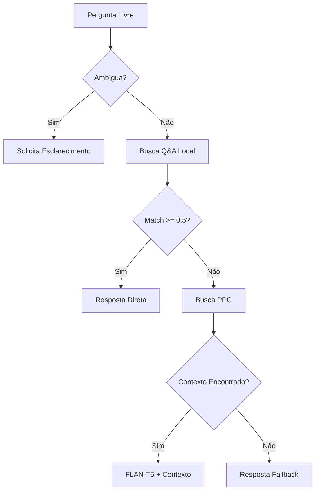

# 💡 Exemplos de Uso - Chatbot Educacional

> **Exemplos práticos de interação e casos de uso para demonstração acadêmica**

## 📋 Índice

- [Casos de Uso Principais](#casos-de-uso-principais)
- [Fluxos de Conversação](#fluxos-de-conversação)
- [Exemplos de Perguntas](#exemplos-de-perguntas)
- [Personalização](#personalização)
- [Análise de Dados](#análise-de-dados)
- [Casos de Teste](#casos-de-teste)

## 🎯 Casos de Uso Principais

### 1. 🎓 Estudante Novo no Curso

**Persona**: João, calouro de Engenharia de Software
**Necessidade**: Informações básicas sobre o curso

**Fluxo típico:**
```
👤 João: /start
🤖 Bot: Menu principal com opções

👤 João: "📚 Informações sobre Estágio"
🤖 Bot: Submenu de estágio

👤 João: "💼 Estágio Curricular Supervisionado"
🤖 Bot: Informações detalhadas sobre estágio obrigatório

👤 João: "Quantas horas de estágio são obrigatórias?"
🤖 Bot: "O estágio obrigatório tem carga horária de 300 horas..."
```

### 2. 📝 Estudante Veterano - TCC

**Persona**: Maria, 8º semestre
**Necessidade**: Orientações sobre TCC

**Fluxo típico:**
```
👤 Maria: "Quais são os pré-requisitos para fazer TCC?"
🤖 Bot: Busca no PPC + resposta contextualizada

👤 Maria: "Como escolher orientador para TCC?"
🤖 Bot: Informações sobre processo de orientação

👤 Maria: "Qual o prazo para entrega do TCC?"
🤖 Bot: Calendário acadêmico + prazos específicos
```

### 3. 🔄 Estudante com Dúvidas Administrativas

**Persona**: Pedro, 5º semestre
**Necessidade**: Informações sobre matrícula e trancamento

**Fluxo típico:**
```
👤 Pedro: "🎓 Informações sobre Matrícula"
🤖 Bot: Menu de matrícula

👤 Pedro: "🔄 Trancamento/Cancelamento"
🤖 Bot: Procedimentos para trancamento

👤 Pedro: "Posso trancar só uma disciplina?"
🤖 Bot: Diferença entre trancamento parcial e total
```

## 💬 Fluxos de Conversação

### Fluxo 1: Navegação por Menus

```mermaid
graph TD
    A[/start] --> B[Menu Principal]
    B --> C[📚 Estágio]
    B --> D[🎓 Matrícula]
    B --> E[📝 Dados Acadêmicos]
    B --> F[📞 Coordenação]
    
    C --> C1[💼 Estágio Supervisionado]
    C --> C2[🏢 Empresas Conveniadas]
    C --> C3[🚀 Iniciativa Empreendedora]
    
    D --> D1[📅 Calendário]
    D --> D2[📝 Como Matricular]
    D --> D3[🔄 Trancamento]
```

### Fluxo 2: Pergunta Livre com Fallbacks



## 🔍 Exemplos de Perguntas

### Perguntas Bem Estruturadas ✅

```bash
# Estágio
"Quais são os pré-requisitos para fazer estágio?"
"Como encontrar empresas para estágio?"
"Quantas horas de estágio são obrigatórias?"

# Matrícula
"Quando abrem as matrículas do próximo semestre?"
"Como fazer matrícula em disciplina optativa?"
"Qual a carga horária mínima por semestre?"

# TCC
"Quais os pré-requisitos para TCC?"
"Como escolher tema de TCC?"
"Formato da apresentação de TCC?"

# Disciplinas
"Quais disciplinas são obrigatórias no 5º semestre?"
"O que são atividades complementares?"
"Como solicitar equivalência de disciplina?"
```

### Perguntas Ambíguas (Sistema detecta) ⚠️

```bash
# Muito genéricas
"Como funciona?"
"O que é isso?"
"Me ajuda"

# Muito vagas
"Estágio"
"Matrícula"
"Curso"

# Sem contexto suficiente
"Quantas horas?"
"Quando é?"
"Onde fica?"
```

**Resposta do sistema:**
```
🤔 Sua pergunta precisa de mais detalhes para eu te ajudar melhor.

**Você está perguntando sobre:**
• Estágio obrigatório ou voluntário?
• Matrícula em disciplinas ou no curso?
• Prazos específicos ou procedimentos?

💡 **Dica:** Seja mais específico em sua pergunta para obter uma resposta mais precisa.
```

## 🎨 Personalização

### Adicionando Novas Perguntas

```json
{
  "pergunta": "Como fazer iniciação científica?",
  "variacoes": [
    "Como participar de pesquisa",
    "Iniciação científica ES",
    "Projetos de pesquisa"
  ],
  "resposta": "**Iniciação Científica em ES:**\n\n• Procure professores com projetos\n• Consulte editais PIBIC\n• Participe de grupos de pesquisa",
  "tags": ["pesquisa", "iniciação", "científica", "pibic"],
  "categoria": "pesquisa"
}
```

### Customizando Menus

```python
# Novo menu para pós-graduação
POS_GRADUACAO_MENU = [
    ["🎓 Mestrado em ES"],
    ["📚 Disciplinas de Pós"],
    ["🔬 Linhas de Pesquisa"],
    ["📝 Processo Seletivo"],
    ["🔙 Voltar ao Menu Principal"]
]
```

### Configurando Analytics Personalizados

```python
# Tracking de eventos específicos
vercel_storage.store_analytics("pergunta_tcc", {
    "user_id": user_id,
    "pergunta": question,
    "resposta_encontrada": True,
    "metodo": "busca_local"  # ou "ppc" ou "flan"
})
```

## 📊 Análise de Dados

### Métricas de Uso

```python
# Exemplo de relatório de uso
{
    "periodo": "2024-01",
    "total_usuarios": 150,
    "total_mensagens": 1200,
    "categorias_mais_consultadas": [
        {"categoria": "estágio", "count": 450},
        {"categoria": "matrícula", "count": 320},
        {"categoria": "tcc", "count": 280}
    ],
    "taxa_resolucao": 0.85,
    "tempo_resposta_medio": 1.2
}
```

### Dashboard Básico

```python
# Geração de relatórios
def gerar_relatorio_uso():
    dados = vercel_storage.get_analytics_summary()
    
    print(f"Usuários ativos: {dados['usuarios_unicos']}")
    print(f"Perguntas por categoria:")
    for cat, count in dados['categorias'].items():
        print(f"  {cat}: {count}")
    print(f"Taxa de sucesso: {dados['taxa_sucesso']:.2%}")
```

## 🧪 Casos de Teste

### Testes Funcionais

```python
def test_menu_navigation():
    """Testa navegação básica pelos menus"""
    # Simula /start
    response = bot.handle_start()
    assert "Menu Principal" in response
    
    # Simula seleção de estágio
    response = bot.handle_menu("📚 Informações sobre Estágio")
    assert "estágio" in response.lower()

def test_question_processing():
    """Testa processamento de perguntas"""
    # Pergunta bem estruturada
    response = bot.process_question("Quantas horas de estágio?")
    assert "300 horas" in response
    
    # Pergunta ambígua
    response = bot.process_question("Estágio")
    assert "mais específico" in response
```

### Testes de Performance

```python
import time

def test_response_time():
    """Testa tempo de resposta"""
    start = time.time()
    response = bot.process_question("Como fazer matrícula?")
    end = time.time()
    
    response_time = end - start
    assert response_time < 3.0  # Menos de 3 segundos
    assert len(response) > 50   # Resposta substancial
```

### Testes de Integração

```python
def test_ppc_search_integration():
    """Testa integração com busca no PPC"""
    results = ppc_search.search_ppc("estágio obrigatório")
    assert len(results) > 0
    assert any("300" in str(result) for result in results)

def test_flan_service_integration():
    """Testa integração com FLAN-T5"""
    if flan_service.model:
        response = flan_service.generate_response(
            "Como fazer estágio?",
            "Contexto: estágio obrigatório 300 horas"
        )
        assert len(response) > 20
        assert "estágio" in response.lower()
```

## 📱 Exemplos de Interface

### Mensagem de Boas-vindas

```
🎓 Olá João! Bem-vindo ao ChatBot da Coordenação de Engenharia de Software.

Escolha uma opção abaixo ou digite sua pergunta.

┌─────────────────────────────┐
│ 📚 Informações sobre Estágio │
│ 🎓 Informações sobre Matrícula │
│ 📝 Registrar Dados Acadêmicos │
│ 📞 Fale com a Coordenação    │
│ 🏆 Atividades Complementares │
└─────────────────────────────┘
```

### Resposta Estruturada

```
**💼 Estágio Curricular Supervisionado**

**Carga Horária:** 300 horas obrigatórias

**Pré-requisitos:**
• Ter cursado 70% das disciplinas obrigatórias
• Estar regularmente matriculado
• Não ter dependências em disciplinas básicas

**Processo:**
1. Encontrar empresa/instituição
2. Preencher documentação
3. Aprovação da coordenação
4. Início das atividades

**Documentos necessários:**
• Termo de Compromisso
• Plano de Atividades
• Seguro contra acidentes

📞 **Dúvidas?** Contate: es@quixada.ufc.br
```

### Tratamento de Multimídia

```
📷 **Imagem recebida!**

Ainda não consigo analisar imagens, mas estou evoluindo! 🤖

💡 **Por enquanto, você pode:**
• Descrever o conteúdo da imagem em texto
• Fazer sua pergunta por escrito
• Usar o menu principal para navegar

📞 **Precisa de ajuda?** Contate: es@quixada.ufc.br
```

## 🎯 Cenários de Demonstração

### Para Apresentação de TCC

1. **Demonstração Básica** (5 minutos)
   - Iniciar bot com /start
   - Navegar pelos menus principais
   - Fazer pergunta sobre estágio
   - Mostrar resposta contextualizada

2. **Demonstração Avançada** (10 minutos)
   - Pergunta ambígua → esclarecimento
   - Pergunta específica → busca local
   - Pergunta complexa → FLAN-T5
   - Análise de logs/analytics

3. **Demonstração Técnica** (15 minutos)
   - Arquitetura do sistema
   - Processamento de PDF
   - Algoritmo de similaridade
   - Deploy e monitoramento

---

*Estes exemplos demonstram a funcionalidade completa do sistema desenvolvido para o TCC, evidenciando tanto a utilidade prática quanto a robustez técnica da solução.*
